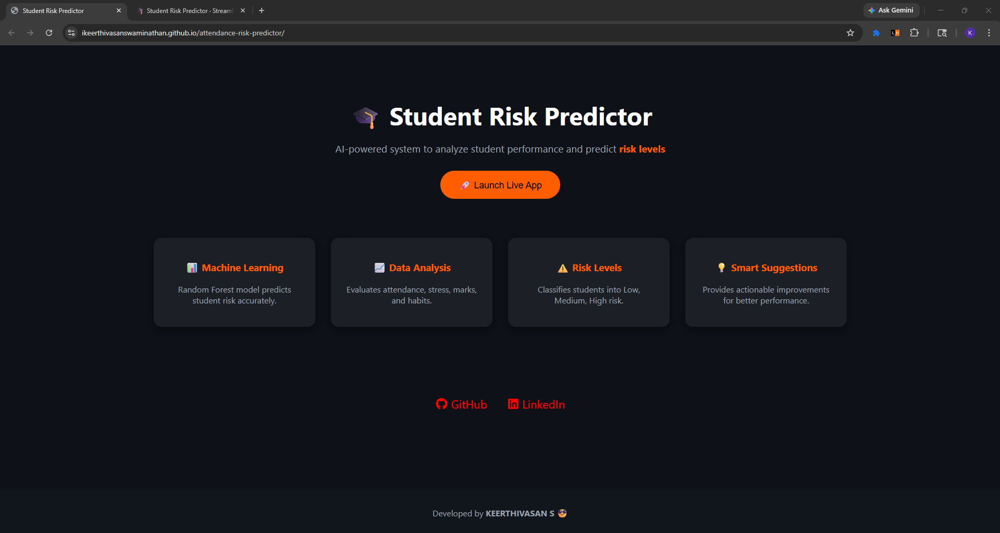
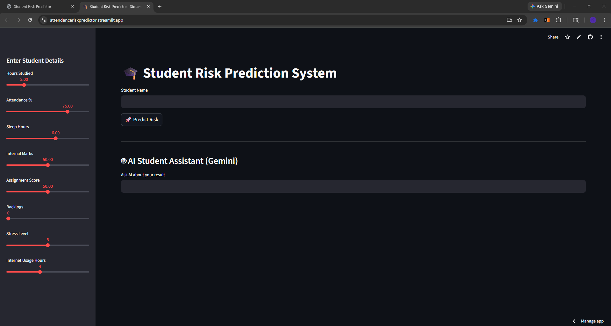
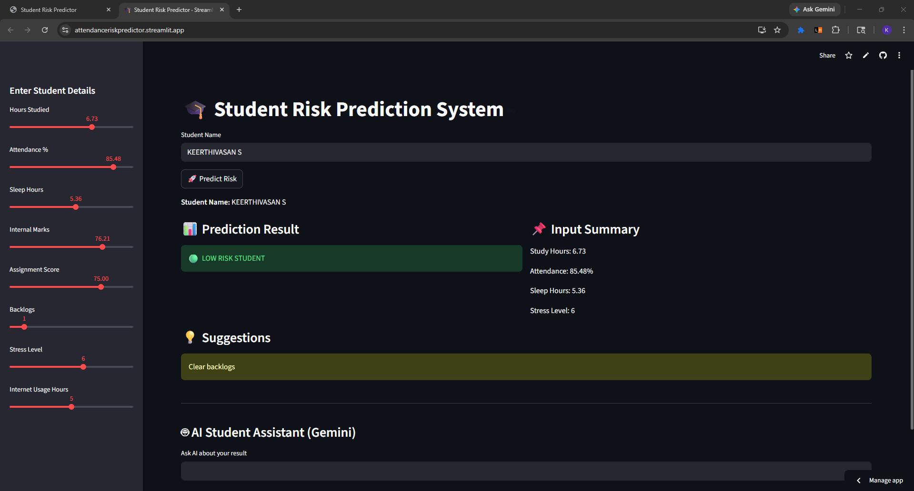

# Student Risk Predictor

A simple machine learning project that predicts whether a student is at risk based on study habits and academic performance.

Live demo: [https://attendanceriskpredictor.streamlit.app/](https://attendanceriskpredictor.streamlit.app/)

---

## What this project does

This app helps estimate student performance risk using basic inputs like study hours, attendance, sleep, and internal marks. It gives a simple output showing whether the student is at low, medium, or high risk.

---

## Tech used

* Python
* Streamlit
* Pandas
* NumPy
* Scikit-learn

---

## How to run

```bash
# clone the repo
git clone https://github.com/your-username/student-risk-predictor.git

cd student-risk-predictor

# install dependencies
pip install -r requirements.txt

# run the app
streamlit run app.py
```

---

## Inputs used

* Hours studied
* Classes attended
* Total classes
* Sleep hours
* Internal marks

---

## Output

* Low risk
* Medium risk
* High risk

---

## 📸 Screenshots

### GitHub Page



### Streamlit Page



#### Giving Input



## 🔗 Connect with me

[](https://github.com/ikeerthivasanswaminathan) [](https://linkedin.com/in/ikeerthivasanswaminathan)
---

## Note

This is a beginner-friendly ML project created for learning and college-level demonstration.

---

## ⭐ Show Support

If you like this project, please ⭐ the repository and share it!